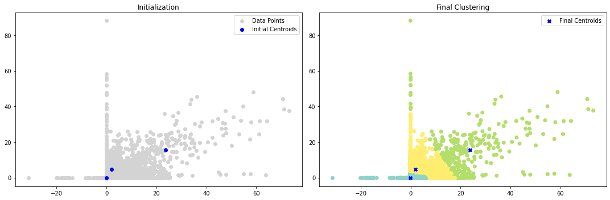
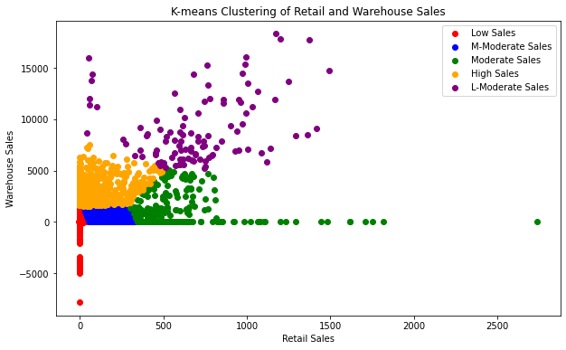
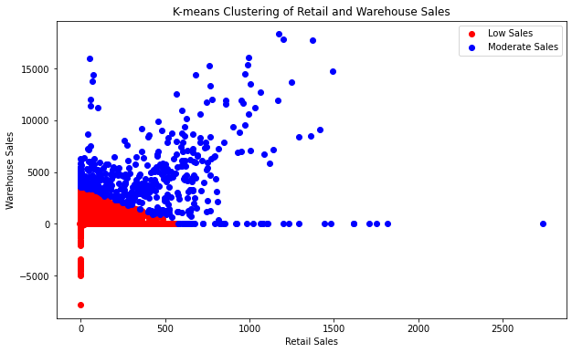

# Retail and Warehouse Sales Clustering

This repository contains an analysis of retail and warehouse sales data using K-means clustering. The project aims to segment sales data into distinct clusters and uncover valuable insights.

## Project Overview

The goal of this analysis is to apply K-means clustering to sales data and understand the patterns and trends within different sales clusters. We use Python and libraries like pandas, scikit-learn, and matplotlib to conduct the analysis.

## Tools and Technologies Used

Python, pandas, scikit-learn, matplotlib

## Analysis Steps

1. Data Preprocessing
2. Feature Selection
3. K-means Clustering
4. Visualization

## Key Findings

- By using K-means clustering, we identified three distinct sales clusters: Low Sales, Moderate Sales, and High Sales.
- The clusters reveal clear patterns in sales distribution across months, with the general shape being consistent for each month.
- We also conducted an analysis with 2 clusters, which revealed a different perspective on the data. While the silhouette score was higher for the 2-cluster analysis, the 5-cluster analysis provided more granularity in capturing different levels of sales.
- In the 5-cluster analysis, the colors of the clusters fluctuated across months due to the varying distribution of sales. This indicates that the clusters adapted to the data's characteristics.
- Despite the fluctuations in colors, the overall density and shapes of the clusters remained consistent, highlighting the stability of the segmentation.

## Visualizations
- Initialization and Finalization clustering (3) based on retail and warehouse sales

- Initialization and Finalization clustering (5) based on retail and warehouse sales

  
- 5-Cluster Scatters for total 2017-2020 plot based on retail and warehouse sales

- 2-Cluster Scatters for total 2017-2020 plot based on retail and warehouse sales

## Key Takeaways

- The analysis with 5 clusters provides detailed insights into different sales levels, allowing for more targeted decision-making in inventory management.
- The consistent shapes of clusters across months suggest stable patterns in sales behavior.
- Both the 2-cluster and 5-cluster analyses contribute different perspectives, and the choice of clusters depends on the level of detail needed for the analysis.

